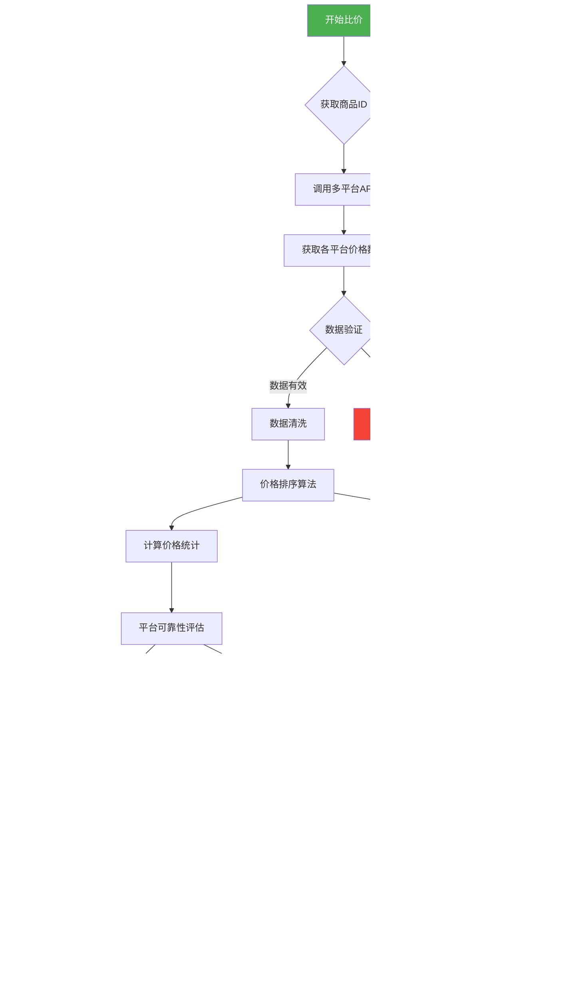

# 商品比价算法流程图

```mermaid
flowchart TD
    A[开始比价] --> B{获取商品ID}
    B --> C[调用多平台API]
    C --> D[获取各平台价格数据]
    D --> E{数据验证}
    E -->|数据有效| F[数据清洗]
    E -->|数据无效| G[返回错误信息]

    F --> H[价格排序算法]
    H --> I[计算价格统计]
    I --> J[平台可靠性评估]
    J --> K[智能推荐算法]
    K --> L[生成比价报告]
    L --> M[返回比价结果]

    H --> H1[按价格升序排序]
    H1 --> H2{价格相等?}
    H2 -->|是| H3[按评分降序]
    H2 -->|否| H4[保持价格顺序]

    J --> J1[用户评分 40%]
    J1 --> J2[销量 30%]
    J2 --> J3[响应时间 20%]
    J3 --> J4[退货率 10%]
    J4 --> J5[计算综合评分]

    K --> K1[最佳价格推荐]
    K1 --> K2[性价比推荐]
    K2 --> K3[可靠性推荐]

    M --> N[结束]

    style A fill:#4CAF50,color:#fff
    style M fill:#4CAF50,color:#fff
    style N fill:#4CAF50,color:#fff
    style G fill:#f44336,color:#fff
```