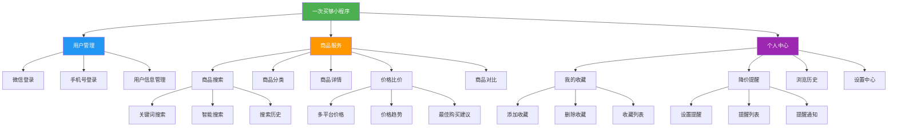

# 系统功能结构图

```mermaid
graph TD
    A[一次买够小程序] --> B[用户管理]
    A --> C[商品服务]
    A --> D[个人中心]

    B --> B1[微信登录]
    B --> B2[手机号登录]
    B --> B3[用户信息管理]

    C --> C1[商品搜索]
    C --> C2[商品分类]
    C --> C3[商品详情]
    C --> C4[价格比价]
    C --> C5[商品对比]

    C1 --> C11[关键词搜索]
    C1 --> C12[智能搜索]
    C1 --> C13[搜索历史]

    C4 --> C41[多平台价格]
    C4 --> C42[价格趋势]
    C4 --> C43[最佳购买建议]

    D --> D1[我的收藏]
    D --> D2[降价提醒]
    D --> D3[浏览历史]
    D --> D4[设置中心]

    D1 --> D11[添加收藏]
    D1 --> D12[删除收藏]
    D1 --> D13[收藏列表]

    D2 --> D21[设置提醒]
    D2 --> D22[提醒列表]
    D2 --> D23[提醒通知]

    style A fill:#4CAF50,color:#fff
    style B fill:#2196F3,color:#fff
    style C fill:#FF9800,color:#fff
    style D fill:#9C27B0,color:#fff
```